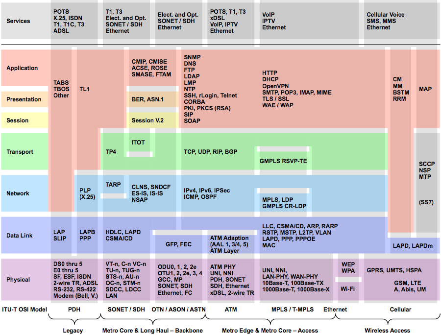
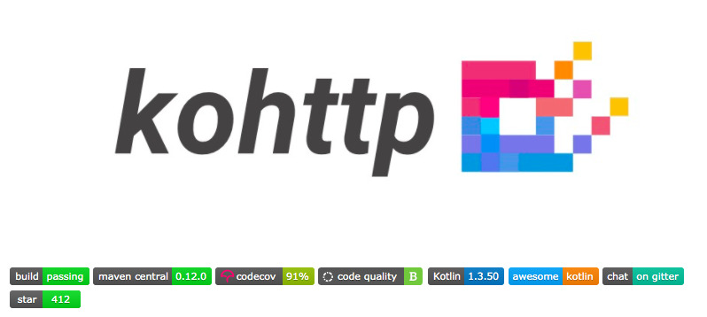

## Java As A Second Language
### Lecture 04
### Web Development with Java


--- 
# Homework 2. Q/A

---
# Stream practice solution

---
## HTTP
- **[HTTP]**
- REST
- Java HTTP Client
- Web Service with Spring Boot
- Testing HTTP Services

---
## OSI model


---
## HTTP - Application layer client-server protocol


---

## HTTP Basics
[https://www.w3.org/Protocols/rfc2616/rfc2616-sec9.html](https://www.w3.org/Protocols/rfc2616/rfc2616-sec9.html)
- **Resource** - any entity
- **URI** - (Universal Resource Identifiers)
- **Method** - what to do with **resource**

---

## HTTP Server
Aka **Web Server**.
Serves HTTP requests. (By default on **80 TCP port**)
- Apache
- NGINX
- embedded (as a library) - Jetty/Embedded Tomcat

Some web servers can be extended by custom logic  
For java you can use Servlet container, like **tomcat** to serve with custom jav code

---

## HTTP Client
- web browser
- cURL
- libraries (e.g. **libcurl**)
- telnet

---
## Ads

[kohttp](https://github.com/rybalkinsd/kohttp) - Kotlin DSL HTTP client 
 


---
## HTTP via telnet
```bash
> telnet example.com 80
```

^^^
## Request
```http
GET /index.html HTTP/1.1
host: example.com
```

^^^
## Response
```http
HTTP/1.1 200 OK
Accept-Ranges: bytes
Age: 452284
Cache-Control: max-age=604800
Content-Type: text/html; charset=UTF-8
Date: Tue, 06 Oct 2020 17:42:54 GMT
Etag: "3147526947+gzip"
Expires: Tue, 13 Oct 2020 17:42:54 GMT
Last-Modified: Thu, 17 Oct 2019 07:18:26 GMT
Server: ECS (dcb/7F83)
Vary: Accept-Encoding
X-Cache: HIT
Content-Length: 1256

<!doctype html>
<html>
<head>
    <title>Example Domain</title>
    ...
```

---

## HTTP Request
**Request consists of**
1. Request header (starting with **method**)
1. Request body


^^^
## Methods
- **GET**
Request resource. **GET** must not change resource
- **POST**
Creates new resource
- **PUT**
Changes resource
- **DELETE**
removes resource
- ...

---

## HTTP Response
**Response consists of**
1. Status code
1. Response header
1. Response Body

[rfc2616](https://www.w3.org/Protocols/rfc2616/rfc2616-sec10.html)  
[wiki](https://en.wikipedia.org/wiki/List_of_HTTP_status_codes)

---

## HTTP via browser
When you enter address line in a browser, it creates a **GET** request.
So we can do previous example just by typing in a browser:
> example.org

---
### When to use HTTP for inter-program communication?
**When we want:**
- simplicity (easy to develop and test)
- scalability (just use load balancer, i.e. **nginx**)

**under restrictions:**
- mediocre performance (not real time)
- client-server only - no push requests from server

---
## cURL
Super popular command line tool for multiple protocols testing (including **HTTP**)   
[https://curl.haxx.se/](https://curl.haxx.se/)  
it wraps **libcurl** library, which is available for all major languages

---

## GET Example
Request from cURL:
```bash
> curl -i -X GET example.com
```


^^^
Response:
```http
HTTP/1.1 200 OK
Accept-Ranges: bytes
Cache-Control: max-age=604800
Content-Type: text/html
Date: Wed, 14 Mar 2018 11:30:27 GMT
Etag: "1541025663"
Expires: Wed, 21 Mar 2018 11:30:27 GMT
Last-Modified: Fri, 09 Aug 2013 23:54:35 GMT
Server: ECS (dca/24A0)
Vary: Accept-Encoding
X-Cache: HIT
Content-Length: 1270

<!doctype html>
<html>
  <head>
    ...
```

---

## POST Example
Raw HTTP:
```http
POST /chat/say HTTP/1.1
Content-Type: application/x-www-form-urlencoded
Host: localhost:8080

msg=Hi everyone in this chat!
```
cURL:
```bash
> curl -X POST \
-d 'msg=Hi everyone in this chat!' \
http://localhost:8080/chat/say?name=MY_NAME
```
response:
```http
HTTP/1.1 200 OK
Date: Wed, 11 Oct 2017 14:17:11 GMT
Content-Length: 0
Server: Jetty(9.4.z-SNAPSHOT)

```


---
## REST
- HTTP
- **[REST]**
- Java HTTP Client
- Web Service with Spring Boot
- Testing HTTP Services

---
## REST
**REST** (Representational State Transfer) architecture style, where services communicate over **HTTP**.  
There are also some restrictions on how services must use HTTP for communication.

---
## REST API
REST API is a common way for services to publish their functionality for other services.  

---
### REST API Examples:
**Twitter:** [https://dev.twitter.com/rest/public](https://dev.twitter.com/rest/public)  
**Github:** [https://developer.github.com/v3/](https://developer.github.com/v3/)

---
## Java HTTP Client
- HTTP
- REST
- **[Java HTTP Client]**
- Web Service with Spring Boot
- Testing HTTP Services

---
## Chat REST API
We got a chat REST service open for you on **http://3.236.217.35/**  

---
## Practice 1. Implement chat client

---

## Chat REST API. View Online
online:
```
    Protocol: HTTP
    Path: chat/online
    Method: GET
    Host: {IP}:8080
    Response:
      Success code: 200
```

---

## Chat REST API. Login
login:
```
    Protocol: HTTP
    Path: chat/login
    Method: POST
    QueryParam: name
    Host: {IP}:8080
    Response:
      Success code: 200
      Fail code:
        400 - Already logged in
        400 - Too long name (longer than 30 symbols)
```
---

## Chat REST API. View chat
chat:
```
    Protocol: HTTP
    Path: chat/chat
    Method: GET
    Host: {IP}:8080
    Response:
      Success code: 200
```

---

## Chat REST API. Say
say:
```
    Protocol: HTTP
    Path: chat/say
    Method: POST
    QueryParam: name
    Body:
      msg="my message"
    Host: {IP}:8080
    Response:
      Success code: 200
      Fail code:
        400 - User not online
        400 - Too long message (longer than 140 symbols)
```


---
## Java Http Client
We will use a built-in http client.

@See ChatClient


---
## Web Service with Spring Boot
- HTTP
- REST
- Java HTTP Client
- **[Web Service with Spring Boot]**
- Testing HTTP Services

---

### Spring
 
 
A universal open-source framework, used to develop web applications.  
https://spring.io/  
  
First version - **2002**

---

### Spring modules
It includes a number of modules for different functionality:
- Spring MVC for building Web Applications
- Working with Databases
- Messaging
- RPC
- Security
- Testing
  
Today we will build web application with **Spring MVC** module

---

### MVC
**MVC (Model-View-Controller)** - popular pattern used to build web apps.


---

### Spring MVC
**Spring MVC** - Spring Module that make it easier to build MVC Applications (Like **Django**, **Rails**)

^^^


---
### Spring Boot
Spring is a powerful tool and has a lot of configuration options.  

^^^
**Spring Boot** is a project, that makes working with Spring easier:
- embedded tomcat included with servlet container
- minimum configuration, sane defaults
- metrics, health checks and externalized configuration
- spring boot starters
https://projects.spring.io/spring-boot/  
  
First version: **2014**

---
## Generate project with spring initializr
https://start.spring.io/  
Add dependencies:
- Spring Web (MVS Framework)
- Spring Boot Actuator (monitor application via HTTP)
Unzip anywhere

---
## What is inside
- build.gradle
Change:
```kotlin
sourceCompatibility = '14'
```
- Application.java
What is @SpringBootApplication ?
- application.properties
Add:
```properties
# expose all actuator endpoints
management.endpoints.web.exposure.include=*
```

---
## Start
### Check service
```shell script
curl localhost:8080/currenttime
```
```properties
curl localhost:8080/actuator
```
---
## Practice 2. Implement Current Time HTTP Service


---
## What is inside?
- DI
- Rest Controller

---
## Practice 3 - chat. Implement Chat Server
@see lecture04/chat


---
## TIL
- know HTTP
- You can build REST services for API
- Spring is a powerful framework that can help to build complex scalable applications
- Spring Boot makes it even easier by building your service with pre-defined components (spring-boot-starters)
- Spring Boot Actuator gives you visibility of your service
- web services are fun!